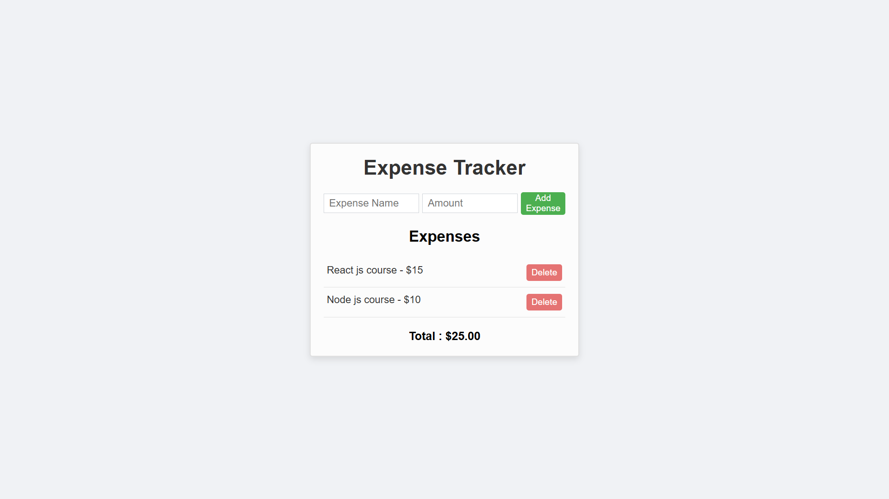

# 💸 Expense Tracker

A simple and responsive web application to **track your daily expenses**. Add and delete entries, and view your total spending — all stored locally in your browser using `localStorage`.

---

## 📸 Screenshot

---

## 🚀 Features

- ✅ Add new expenses (Name + Amount)
- 🗑️ Delete any expense
- 💾 Data saved in browser using `localStorage`
- 📊 Real-time total amount calculation
- 📱 Fully responsive and user-friendly design

---

## 🛠️ Technologies Used

- HTML5
- CSS3
- JavaScript (Vanilla)
- `localStorage` API

---

## 🔗 Live Demo

[Click here to see the live project](https://pocket-track.vercel.app/)

---

## 🧑‍💻 Author

**Abhishek Kumar**

- Twitter: [@webabhishek7](https://x.com/webabhishek7)
- LinkedIn: [abhishek7199](https://www.linkedin.com/in/abhishek7199/)

---

## ⭐ Show some love

If you like this project, please ⭐ the repository and share it!

---
